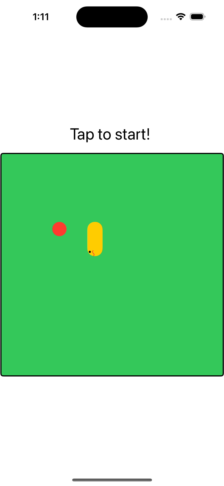
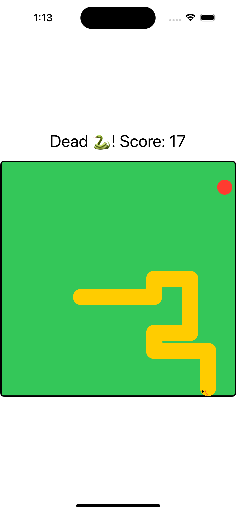

# Snake

An open-source iOS game inspired by the class [Snake game](https://en.wikipedia.org/wiki/Snake_(video_game_genre)).

## Features

- Tap to start.
- Swipe to turn 🐍.
- Increment score when 🐍 eats food.
- Collision detection.

### Screenshots

| Start | Dead |
| --- | --- |
|  |  |

## Build locally

1. Clone repo.
1. Open `Snake.xcodeproj`.
1. Build and run.
